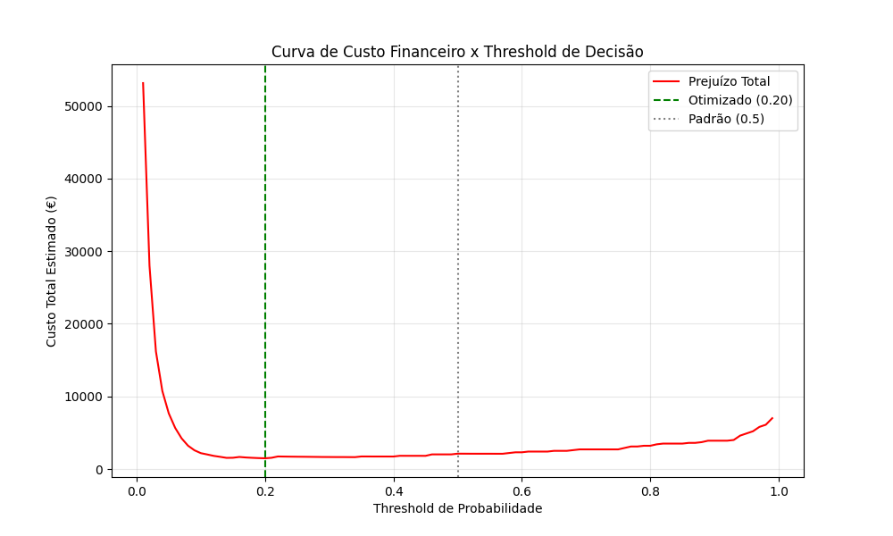
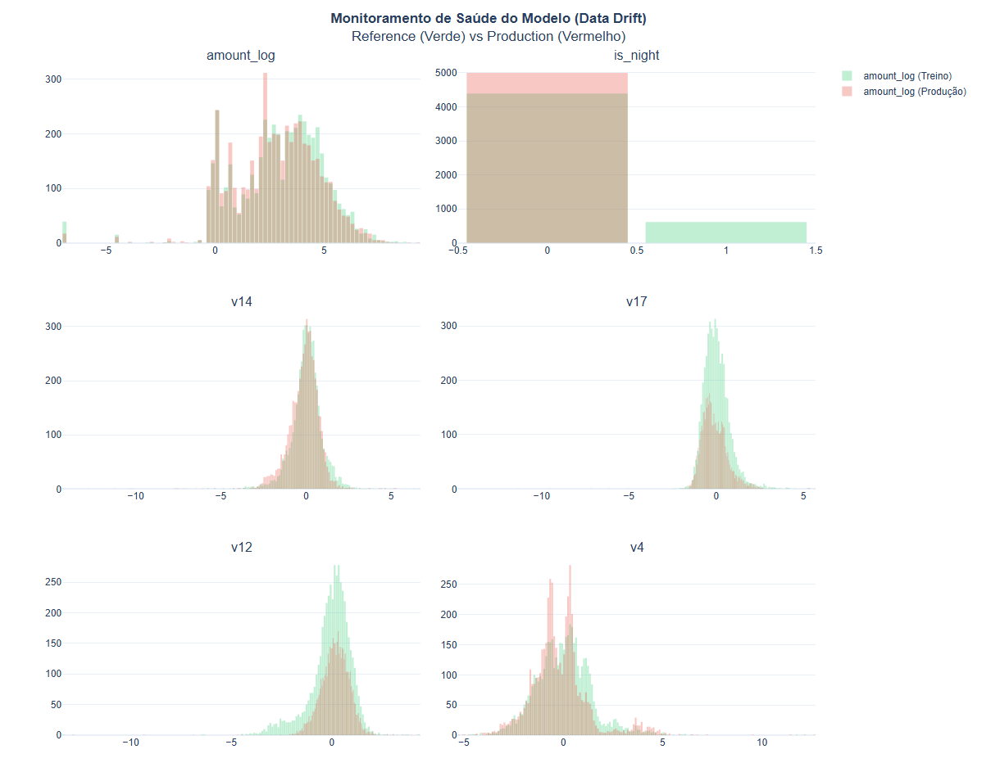

# 🛡️ Fraud Detection System


## 📌 Visão Geral
Este projeto implementa um pipeline End-to-End de Data Science para detecção de fraudes, desenhado sob a perspectiva de **Prevenção de Perdas (Loss Prevention)**. O foco é equilibrar a precisão técnica com restrições operacionais reais, como latência e capacidade de revisão manual.

O diferencial deste projeto é a aplicação de **Split Temporal Rigoroso**, **Feature Engineering Customizada** e uma estratégia de **Modelagem Challenger vs Baseline**.

---

## 💼 1. O Problema de Negócio
O objetivo não é apenas "prever fraude", mas reduzir o prejuízo financeiro (Chargeback) minimizando o atrito com o cliente (Falsos Positivos).

### KPIs & Restrições
* **KPI Primário (Eficácia):** Recall (Taxa de Detecção). *Meta: > 70% com alta precisão.*
* **KPI Secundário (Eficiência):** False Positive Rate (FPR). *Meta: Minimizar bloqueios indevidos.*
* **Restrição Operacional:** O time de fraude analisa no máximo 50 casos/dia.
* **SLA Técnico:** Inferência em < 100ms (API Real-time).

---

## 🏗️ 2. Engenharia de Dados (Pipeline)
Segue a **Medallion Architecture** para garantir a linhagem dos dados.

* **Bronze (Raw):** Dados brutos (`creditcard.csv`) ingeridos via Kaggle API.
* **Silver (Padronizada):** Conversão para Parquet (Tipagem forte) e **Time-based Split** (respeitando a temporalidade dos eventos).
* **Trusted (Cleaned & Split):** Deduplicação e Split Temporal (Treino/Teste).
* **Gold (Features):** Dados enriquecidos com lógica de negócio (`is_night`, `amount_log`). 

---

## 🧠 3. Inteligência e Análise (EDA & Feature Eng.)
### 📊 Visualização dos Insights
*Durante a EDA (focada apenas no Treino), padrões críticos:*

**1. O Crime não dorme (Padrão Temporal)**
*Fraudes (Vermelho) persistem na madrugada, enquanto transações legítimas (Verde) caem.*


**2. A Assinatura do Golpe (Top Features)**
*Variáveis como V17 e V14 mostram separação clara entre classes.*


### Feature Engineering
Traduz esses insights em código na camada **Gold**:
* `is_night`: Flag de risco para transações na madrugada.
* `amount_log`: Normalização logarítmica de valores monetários.

---

## 🤖 4. Estratégia de Modelagem (Baseline vs Challenger)
Adota uma abordagem competitiva para seleção do modelo.

| Modelo | Arquitetura | Recall | Precisão | Falsos Positivos (Teste) | Veredito |
| :--- | :--- | :--- | :--- | :--- | :--- |
| **Baseline** | Logistic Regression (Balanced) | **93%** | 2% | 2.783 (Inviável) | ❌ Descartado |
| **Challenger** | **Random Forest (Balanced)** | 72% | **88%** | **7 (Excelente)** | ✅ **Vencedor** |

**Decisão de Negócio:**
Embora o Baseline tenha maior Recall, ele inviabilizaria a operação (2.7k bloqueios indevidos em 2 dias). O **Challenger (Random Forest)** foi escolhido por entregar uma operação cirúrgica: alta taxa de acerto com atrito mínimo para o cliente.

---
## 💰 5. Validação e Impacto Financeiro (Etapa 8)
Modelo de fraude para threshold de 0.20. Realiza uma simulação de **Profit & Loss** considerando:
* **Custo da Fraude (FN):** € 100 (Chargeback médio)
* **Custo do Bloqueio (FP):** € 2 (Fricção com cliente/SMS)

### Resultado da Otimização


* **Threshold Otimizado:** Ajustado de 0.50 para **0.20**.
* **Impacto:** Economia projetada de **€ 636 (+30%)** no set de teste.
* **Trade-off:** Recupera **+8 fraudes** aceitando um aumento controlado nos bloqueios (de 7 para 89).

---
## 🚀 6. Deploy e Integração (Etapa 9)
Implementa uma **API REST com FastAPI** para servir o modelo em tempo real.

* **Arquitetura:** * Input: JSON (Simulando transação).
    * Processing: Pipeline de Feature Engineering em tempo real (Recálculo de `is_night`, `amount_log`).
    * Inference: Modelo Challenger (Random Forest).
    * Output: Decisão de Bloqueio baseada no Threshold de 0.20.
* **Desafio Superado:** Garantia de integridade de esquema (`Schema Enforcement`) para evitar *Training-Serving Skew*, forçando a API a seguir estritamente a ordem de features do treinamento.

---

## 📉 Monitoramento & Governança (Data Drift)
Modelos degradam com o tempo. Implementamos um Dashboard de Monitoramento usando **KS-Test** e **Plotly**.
* **Cenário:** Comparação entre Treino (Passado) e Produção Simulada (Futuro).
* **Resultado:** 🚨 **Drift Crítico Detectado**. O padrão de transações mudou, indicando necessidade de retreino.


*(Print do Dashboard Interativo gerado pelo sistema)*

---

## 🛠️ Tecnologias Utilizadas
* **Linguagem:** Python 3.12+
* **API:** FastAPI, Uvicorn,Pydantic
* **Processamento:** Pandas, NumPy, PyArrow
* **Machine Learning:** Scikit-Learn, joblib, Plotly
* **Visualização:** Seaborn, Matplotlib
* **Ambiente:** Virtualenv
* **Versionamento:** Git

---

## 📂 Estrutura do Repositório
```text
├── data/
│   ├── raw/          # Dados brutos (creditcard.csv)
│   ├── silver/       # Parquet padronizado
│   ├── trusted/      # Dados limpos e divididos (Time-Split)
│   ├── gold/         # Feature Store (Dados prontos para o modelo)
│   └── processed/    # (Reservado para artefatos finais de deploy)
├── reports/
│   └── figures/      # Gráficos gerados (.PNG)
├── models/           # Modelos serializados (.pkl)
├── src/
│   ├── clean_data.py          # Limpeza e Split
│   ├── eda_analysis.py        # Geração de Insights
│   ├── feature_engineering.py # Transformers (Scikit-Learn)
│   ├── train_baseline.py      # Treino Regressão Logística
│   ├── train_challenger.py    # Treino Random Forest
│   ├── evaluate.model.py      # Simulação e Threshold Tuning
│   └── ingest_silver.py       # Ingestão Inicial
├── requirements.txt
└── README.md

 
Como Executar o Projeto

Siga os passos abaixo para reproduzir todo o pipeline, do dado bruto ao dashboard de monitoramento.

1. Configuração do Ambiente

# Clone o repositório
git clone [https://github.com/SEU_USUARIO/NOME_DO_REPO.git](https://github.com/SEU_USUARIO/NOME_DO_REPO.git)
cd NOME_DO_REPO

# Crie e ative o ambiente virtual
python -m venv .venv
source .venv/Scripts/activate  # Windows (Git Bash)
# source .venv/bin/activate    # Linux/Mac

# Instale as dependências
pip install -r requirements.txt
---

2. Pipeline de Dados (ETL)

Execute os scripts na ordem para gerar as camadas Bronze, Silver e Gold.

python src/ingest_silver.py      # Baixa e converte para Parquet
python src/clean_data.py         # Limpeza e Split Temporal
python src/feature_engineering.py # Criação de Features (Feature Store)
---

3. Treinamento e Seleção de Modelos

Treine o Baseline e o Challenger, e depois rode a otimização financeira.

python src/train_baseline.py     # Regressão Logística
python src/train_challenger.py   # Random Forest (Gera o modelo campeão)
python src/evaluate_model.py     # Define o Threshold de 0.20 (Gera gráfico financeiro)
---

4. Subir a API (Produção)

Inicie o servidor FastAPI para fazer previsões em tempo real.

python src/app.py

Acesse a documentação em: http://localhost:8000/docs
---

5. Monitoramento de Drift

Gere o dashboard de governança para verificar a saúde do modelo.

python src/dashboard_drift.py

O relatório será salvo em reports/10_executive_drift_dashboard.html.
---

Autor
Rodrigo Neves