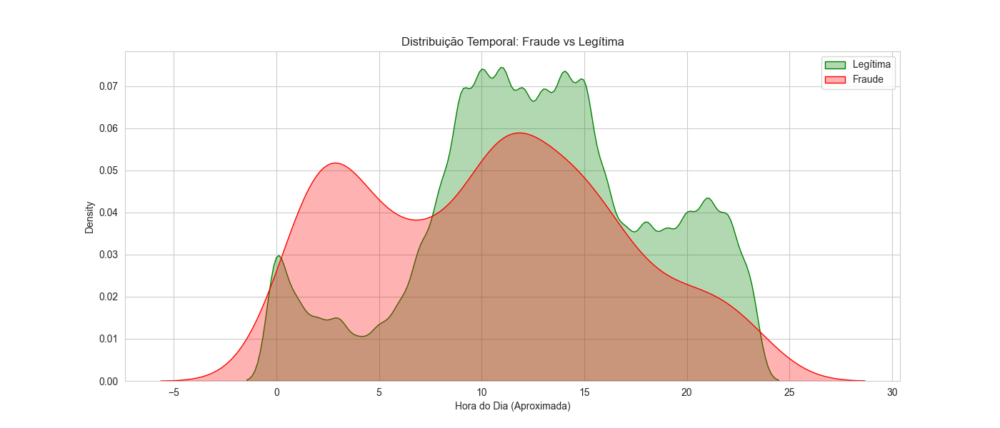

# 🛡️ Fraud Detection System

## 📌 Visão Geral
Este projeto implementa um pipeline End-to-End de Data Science para detecção de fraudes, desenhado sob a perspectiva de **Prevenção de Perdas (Loss Prevention)**. O foco é equilibrar a precisão técnica com restrições operacionais reais, como latência e capacidade de revisão manual.

O diferencial deste projeto é a aplicação de **Split Temporal Rigoroso**, **Feature Engineering Customizada** e uma estratégia de **Modelagem Challenger vs Baseline**.

---

## 💼 1. O Problema de Negócio
O objetivo não é apenas "prever fraude", mas reduzir o prejuízo financeiro (Chargeback) minimizando o atrito com o cliente (Falsos Positivos).

### KPIs & Restrições
* **KPI Primário (Eficácia):** Recall (Taxa de Detecção). *Meta: > 70% com alta precisão.*
* **KPI Secundário (Eficiência):** False Positive Rate (FPR). *Meta: Minimizar bloqueios indevidos.*
* **Restrição Operacional:** O time de fraude analisa no máximo 50 casos/dia.
* **SLA Técnico:** Inferência em < 100ms (API Real-time).

---

## 🏗️ 2. Engenharia de Dados (Pipeline)
Segue a **Medallion Architecture** para garantir a linhagem dos dados.

* **Bronze (Raw):** Dados brutos (`creditcard.csv`) ingeridos via Kaggle API.
* **Silver (Padronizada):** Conversão para Parquet (Tipagem forte).
* **Trusted (Cleaned & Split):** Deduplicação e Split Temporal (Treino/Teste).
* **Gold (Features):** Dados enriquecidos com lógica de negócio. 

---

## 🧠 3. Inteligência e Análise (EDA & Feature Eng.)
### 📊 Visualização dos Insights
*Durante a EDA (focada apenas no Treino), padrões críticos:*

**1. O Crime não dorme (Padrão Temporal)**
*Fraudes (Vermelho) persistem na madrugada, enquanto transações legítimas (Verde) caem.*


**2. A Assinatura do Golpe (Top Features)**
*Variáveis como V17 e V14 mostram separação clara entre classes.*


### Feature Engineering
Traduz esses insights em código na camada **Gold**:
* `is_night`: Flag de risco para transações na madrugada.
* `amount_log`: Normalização logarítmica de valores monetários.

---

## 🤖 4. Estratégia de Modelagem (Baseline vs Challenger)
Adota uma abordagem competitiva para seleção do modelo.

| Modelo | Arquitetura | Recall | Precisão | Falsos Positivos (Teste) | Veredito |
| :--- | :--- | :--- | :--- | :--- | :--- |
| **Baseline** | Logistic Regression (Balanced) | **93%** | 2% | 2.783 (Inviável) | ❌ Descartado |
| **Challenger** | **Random Forest (Balanced)** | 72% | **88%** | **7 (Excelente)** | ✅ **Vencedor** |

**Decisão de Negócio:**
Embora o Baseline tenha maior Recall, ele inviabilizaria a operação (2.7k bloqueios indevidos em 2 dias). O **Challenger (Random Forest)** foi escolhido por entregar uma operação cirúrgica: alta taxa de acerto com atrito mínimo para o cliente.

---

## 🛠️ Tecnologias Utilizadas
* **Linguagem:** Python 3.12+
* **Processamento:** Pandas, NumPy, PyArrow
* **Machine Learning:** Scikit-Learn (Pipelines, Ensembles)
* **Visualização:** Seaborn, Matplotlib
* **Ambiente:** Virtualenv
* **Versionamento:** Git

---

## 📂 Estrutura do Repositório
```text
├── data/
│   ├── raw/          # Dados brutos (creditcard.csv)
│   ├── silver/       # Parquet padronizado
│   ├── trusted/      # Dados limpos e divididos (Time-Split)
│   ├── gold/         # Feature Store (Dados prontos para o modelo)
│   └── processed/    # (Reservado para artefatos finais de deploy)
├── reports/
│   └── figures/      # Gráficos gerados pela EDA (PNGs)
├── models/           # Modelos serializados (.pkl)
├── src/
│   ├── clean_data.py          # Limpeza e Split
│   ├── eda_analysis.py        # Geração de Insights
│   ├── feature_engineering.py # Transformers (Scikit-Learn)
│   ├── train_baseline.py      # Treino Regressão Logística
│   ├── train_challenger.py    # Treino Random Forest
│   └── ingest_silver.py       # Ingestão Inicial
├── requirements.txt
└── README.md

 
Como Executar o Projeto

1.Instale as dependências:
    pip install -r requirements.txt

2. Execute o Pipeline de Dados:
    python src/ingest_silver.py      # 1. Ingestão
    python src/clean_data.py         # 2. Limpeza (Trusted)
    python src/feature_engineering.py # 3. Feature Eng (Gold)

3. Treine e Compare os Modelos:
    python src/train_baseline.py     # Gera baseline_model.pkl
    python src/train_challenger.py   # Gera challenger_model.pkl

Autor
Rodrigo Neves