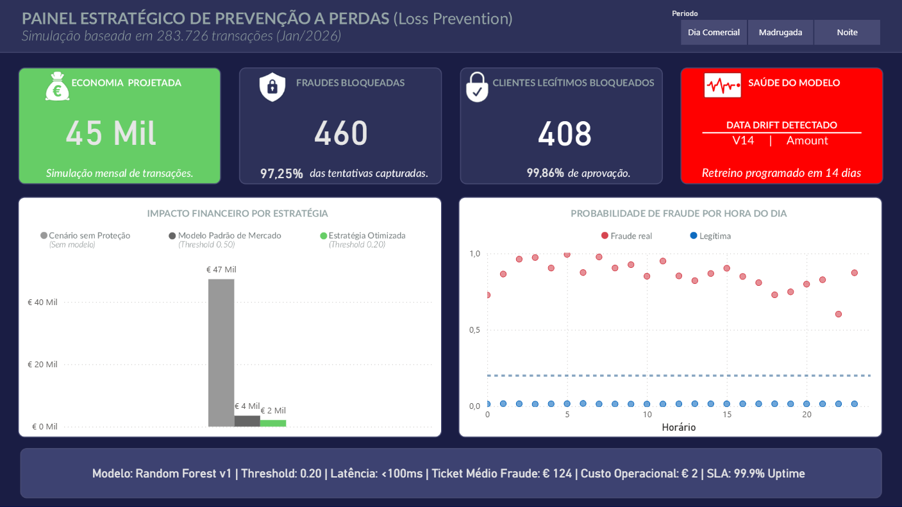

# 🛡️ Fraud Detection System


## 📌 Visão Geral
Este projeto implementa um pipeline End-to-End de Data Science para detecção de fraudes, desenhado sob a perspectiva de **Prevenção de Perdas (Loss Prevention)**. O foco é equilibrar a precisão técnica com restrições operacionais reais, como latência e capacidade de revisão manual.

O diferencial deste projeto é a aplicação de **Split Temporal Rigoroso**, **Feature Engineering Customizada** e uma estratégia de **Modelagem Challenger vs Baseline**.

---

## 💼 1. O Problema de Negócio
O objetivo não é apenas "prever fraude", mas reduzir o prejuízo financeiro (Chargeback) minimizando o atrito com o cliente (Falsos Positivos).

### KPIs & Restrições
* **KPI Primário (Eficácia):** Recall (Taxa de Detecção). *Meta: > 70% das fraudes capturadas.*
* **KPI Secundário (Eficiência):** Taxa de Aprovação. *Meta: Manter > 99% dos clientes legítimos aprovados.*
* **Restrição Operacional:** O time de fraude analisa no máximo 50 casos manuais por dia (Falsos Positivos limitados).
* **SLA Técnico:** Inferência da API em < 100ms (Real-time).

---

## 📊 2. Dashboard Executivo (Power BI)
Para traduzir os modelos matemáticos em resultados financeiros, foi desenvolvido um painel estratégico.


*(Exemplo ilustrativo: Visão de Economia Projetada, Recall e Impacto Financeiro por Estratégia)*

> **Nota:** O arquivo `.pbix` e o script de geração de dados (`export_powerbi.py`) estão disponíveis na pasta `reports/`.
---

## 🏗️ 3. Engenharia de Dados (Pipeline)
Segue a **Medallion Architecture** para garantir a linhagem dos dados.

* **Bronze (Raw):** Dados brutos (`creditcard.csv`) ingeridos via Kaggle API.
* **Silver (Padronizada):** Conversão para Parquet (Tipagem forte) e **Time-based Split** (respeitando a temporalidade dos eventos).
* **Trusted (Cleaned & Split):** Deduplicação e Split Temporal (Treino/Teste).
* **Gold (Features):** Dados enriquecidos com lógica de negócio (`is_night`, `amount_log`). 

---

## 🧠 4. Inteligência e Análise (EDA & Feature Eng.)
### 📊 Visualização dos Insights
*Durante a EDA (focada apenas no Treino), padrões críticos:*

**1. O Crime não dorme (Padrão Temporal)**
*Fraudes (Vermelho) persistem na madrugada, enquanto transações legítimas (Verde) caem.*


**2. A Assinatura do Golpe (Top Features)**
*Variáveis como V17 e V14 mostram separação clara entre classes.*


### Feature Engineering
Traduz esses insights em código na camada **Gold**:
* `is_night`: Flag de risco para transações na madrugada.
* `amount_log`: Normalização logarítmica de valores monetários.

---

## 🤖 5. Estratégia de Modelagem (Baseline vs Challenger)
Adota uma abordagem competitiva para seleção do modelo.

| Modelo | Arquitetura | Recall | Precisão | Falsos Positivos (Teste) | Veredito |
| :--- | :--- | :--- | :--- | :--- | :--- |
| **Baseline** | Logistic Regression (Balanced) | **93%** | 2% | 2.783 (Inviável) | ❌ Descartado |
| **Challenger** | **Random Forest (Balanced)** | 72% | **88%** | **7 (Excelente)** | ✅ **Vencedor** |

**Decisão de Negócio:**
Embora o Baseline tenha maior Recall, ele inviabilizaria a operação (2.7k bloqueios indevidos em 2 dias). O **Challenger (Random Forest)** foi escolhido por entregar uma operação cirúrgica: alta taxa de acerto com atrito mínimo para o cliente.

---
## 💰 Validação Financeira (Profit & Loss)
Otimiza o **Threshold de Decisão** baseado no dinheiro:
* **Custo da Fraude (FN):** € 100 (Chargeback médio)
* **Custo do Bloqueio (FP):** € 2 (Fricção com cliente/SMS)

### Resultado da Otimização


* **Threshold Otimizado:** Ajustado de 0.50 para **0.20**.
* **Impacto:** Economia projetada de **€ 636 (+30%)** no set de teste.

---
## 🚀 7. Deploy (API Real-time) & Monitoramento
Implementa uma **API REST com FastAPI** para servir o modelo em tempo real.

* **Arquitetura:** * Input: JSON (Simulando transação).
    * Processing: Pipeline de Feature Engineering em tempo real (Recálculo de `is_night`, `amount_log`).
    * Inference: Modelo Challenger (Random Forest).
    * Output: Decisão de Bloqueio baseada no Threshold de 0.20.
* **Desafio Superado:** Garantia de integridade de esquema (`Schema Enforcement`) para evitar *Training-Serving Skew*, forçando a API a seguir estritamente a ordem de features do treinamento.

---

## 📉 Monitoramento & Governança (Data Drift)
Modelos degradam com o tempo. Implementamos um Dashboard de Monitoramento usando **KS-Test** e **Plotly**.
* **Cenário:** Comparação entre Treino (Passado) e Produção Simulada (Futuro).
* **Resultado:** 🚨 **Drift Crítico Detectado**. O padrão de transações mudou, indicando necessidade de retreino.


*(Print do Dashboard Interativo gerado pelo sistema)*

---

## 🛠️ Tecnologias Utilizadas
* **Linguagem:** Python 3.12+
* **API:** FastAPI, Uvicorn,Pydantic
* **Processamento:** Pandas, NumPy, PyArrow
* **Machine Learning:** Scikit-Learn, joblib, Plotly
* **Visualização:** Seaborn, Matplotlib
* **Ambiente:** Virtualenv
* **Versionamento:** Git

---

## 📂 Estrutura do Repositório

```text
├── data/                  # (Ignorado no Git) Armazena dados Raw, Silver, Gold
├── reports/
│   ├── figures/           # Gráficos gerados e prints
│   ├── powerbi_dataset/   # CSV gerado para o Dashboard
│   ├── Dashboard.pbix     # Arquivo do Power BI
│   └── drift_report.html  # Relatório de Data Drift
├── models/                # Modelos serializados (.pkl)
├── src/
│   ├── app.py                 # API FastAPI
│   ├── clean_data.py          # Pipeline de Limpeza
│   ├── eda_analysis.py        # Geração de Gráficos e Insights
│   ├── feature_eng...         # Pipeline de Features
│   ├── train_baseline.py      # Treino Regressão Logística
│   ├── train_challenger.py    # Treino Random Forest
│   ├── evaluate_model.py      # Otimização Financeira
│   ├── export_powerbi.py      # Gera dados para o Dashboard PBI
│   ├── monitor_drift.py       # Cálculo de Drift (Evidently/Alibi)
│   └── dashboard_drift.py     # Gera HTML de monitoramento
├── requirements.txt
└── README.md
```
 
## 🛠️ Como Executar o Projeto

Siga os passos abaixo para reproduzir todo o pipeline.

## 1. Configuração do Ambiente

Clone o repositório

git clone [https://github.com/SEU_USUARIO/NOME_DO_REPO.git](https://github.com/SEU_USUARIO/NOME_DO_REPO.git)
cd NOME_DO_REPO

Crie e ative o ambiente virtual

python -m venv .venv

source .venv/bin/activate    # Linux/Mac

.venv\Scripts\activate     # Windows

Instale as dependências

pip install -r requirements.txt

## 2. Pipeline de Dados e Treinamento

**Ingestão e Limpeza**

python src/ingest_silver.py

python src/clean_data.py

**Feature Engineering**

python src/feature_engineering.py

**Treinamento e Avaliação**

python src/train_baseline.py

python src/train_challenger.py

python src/evaluate_model.py  # Gera gráficos financeiros

## 3. Deploy da API

**Inicia o servidor localmente**

python src/app.py

Acesse a documentação: http://localhost:8000/docs

## 4. Dashboards (Drift & Power BI)

**Gera relatório de Drift**

python src/dashboard_drift.py

**Gera dataset para o Power BI**

python src/export_powerbi.py

Abra o arquivo reports/Dashboard.pbix e atualize os dados.

---
## 📚 Referências e Agradecimentos

Este projeto foi desenvolvido aplicando conhecimentos adquiridos através de muita prática, leitura de documentação e cursos de excelência. Um agradecimento especial às fontes que fundamentaram a base técnica deste trabalho:

* **[Data Science Academy](https://www.datascienceacademy.com.br/):** Pelos cursos de *Fundamentos de Engenharia de Dados* e *Microsoft Power BI para Data Science*, essenciais para a visão de pipeline e storytelling de dados.
* **[Téo Me Why](https://www.twitch.tv/teomewhy):** Com ajuda da comunidade e conteúdos práticos sobre Pandas e Machine Learning "hands-on".
* **Documentações Oficiais:** 
    * [Python 3.12 Documentation](https://docs.python.org/3/)
    * [Pandas User Guide](https://pandas.pydata.org/docs/user_guide/index.html)
    * [Scikit-Learn User Guide](https://scikit-learn.org/stable/user_guide.html)
    * [FastAPI Documentation](https://fastapi.tiangolo.com/)

Autor

Rodrigo Neves